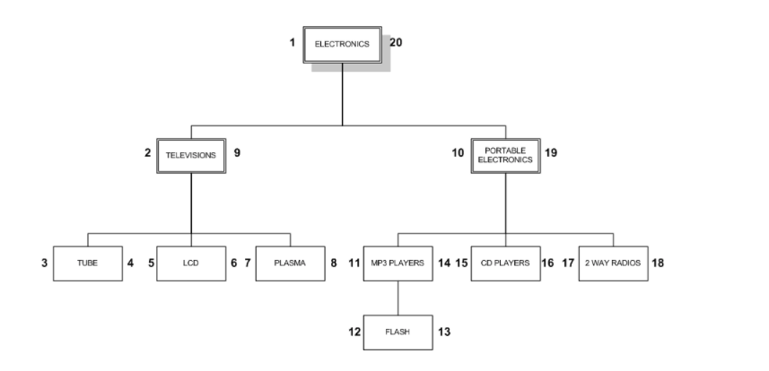
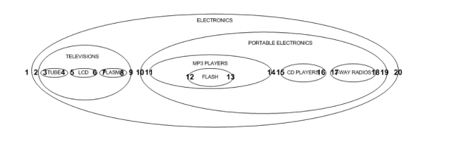

# Nested Set Model

Simple nested set model (java)implementation for managing hierarchical data in an SQL database.

The term was apparently introduced by Joe Celko. Others describe the same technique using 
different terms. Google 'Celko' or 'nested set model' for more info.

## Build
mvn clean install

## Dependencies

The only dependency is Spring's JdbcTemplate. Make sure you have the following in your pom:
 
```
<dependency>
   <groupId>org.springframework</groupId>
   <artifactId>spring-jdbc</artifactId>
   <version>5.0.2.RELEASE</version>
</dependency>
```

## Example hierarchy used in test case




## The "nested set" view




